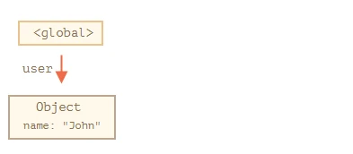
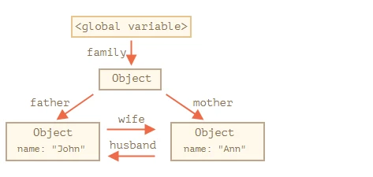
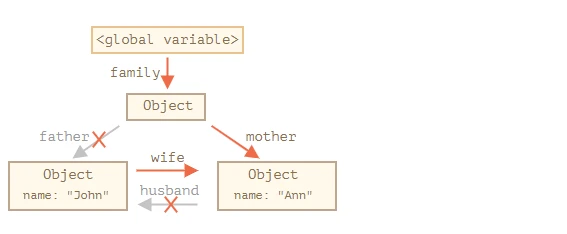
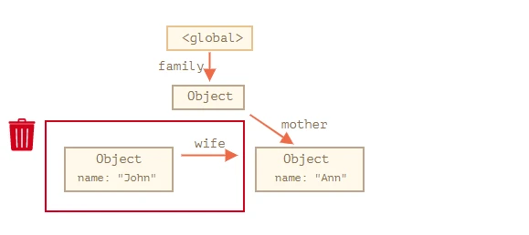
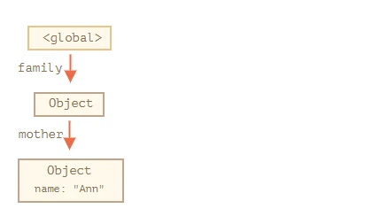
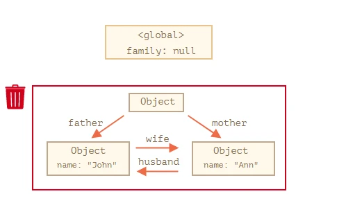
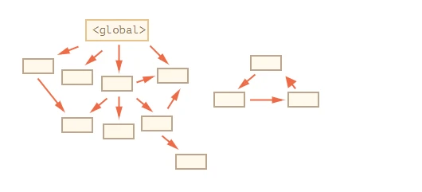
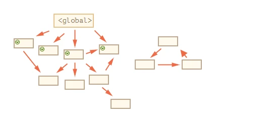
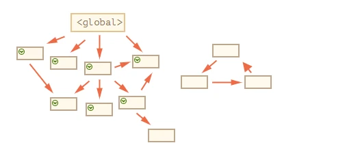
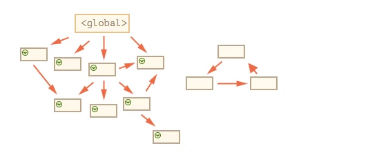

#### JavaScript 的内存管理（垃圾回收机制）

在 JavaScript 中，内存管理是自动执行并且不可见的。我们创建原始数据类型，对象，函数...，都需要占用内存。

当有些变量不再需要的时候会发生什么呢？Javascript 引擎是怎么发现它并且清除它的呢？

##### 可达性（Reachablity）

在内存管理中，主要的概念就是*可达性*。

简单来说，可达性就是指那些可以访问到的或者可以使用的数据。这些数据被存放在内存当中。

1. 有一系列默认拥有可达性特点的值，它们无法被显示删除。 例如：
   - 当前函数的参数和局部变量
   - 嵌套的函数调用链中的其他函数的参数和变量
   - 全局变量
   - （其他一些内在的值）
     这些值被称之为根值（roots）

1. 如果一个根值通过一个引用或者一系列的引用可以访问到其他的值，那么这些值就具有可达性。 例如：假设有一个局部变量存着一个对象 A，这个对象拥有一个属性，这个属性引用了另外一个对象 B，这个对象 A 就具有了可达性，同时这个被对象A所引用的值（对象 B ）也具有可达性。请看下面例子：

在 JavaScript 引擎中存在着一个暗中运行的过程，这个过程称作[垃圾采集器](https://en.wikipedia.org/wiki/Garbage_collection_(computer_science))，垃圾采集器监视着所有的对象，并且把那些不再具有可达性的对象删除。

###### 一个最简单的例子

```javascript
let user = {  
 name: 'John',  
};
```



现在全局变量`user`引用了一个对象`{name: 'john'}`(暂时把它称作 John )，John 的`name`属性保存着一个原始数据，他只存在于 John 这个对象的内部。

如果`user`这个变量的值被覆盖的话，这个引用就消失了。

```javascript
user = null;
```


现在 John 这个对象就再也访问不到了，因为一旦不存在被引用，垃圾采集器就会删除掉这个数据，并且释放内存。

##### 两个引用

现在我们想象一下把`user`的值复制一份给`admin`:

```javascript
let user = {  
 name: 'John'  
};  
  
let admin = user;
```


如果我们继续刚刚的步骤：

```javascript
user = null;
```

现在`John`这个对象仍然是可以通过`admin`访问到的，所以它还会继续存在内存中。如果我们覆盖掉`admin`的值，那么`John`这个对象就会被删除。

#### 互相引用的对象

一个更加复杂的例子，一个家庭：

```javascript
function marry(man, woman) {  
 woman.husband = man;  
 man.wife = woman;  
   
 return {  
 father: man,  
 mether: woman,  
 }  
}  
  
let family = marry({  
 name: 'John',  
},{  
 naem: 'Ann',  
});
```

函数`marry`通过给两个对象的属性互相赋值为另一个对象，来互相引用，并且返回一个新的对象，新的对象中包括这两个对象。

现在，所有的对象都是可访问的。

最终在内存中的结构为：



现在我们移除掉两个引用：

```javascript
delete family.father;  
delete family.mother.husband;
```



如果存在两个引用，只删除一个引用是没有用的，因为所有的对象仍然具有可访问性。

但是如果我们把两个都删除，那么`John`这个对象就不再被引用了。



虽然`John`这个对象也引用了另外的对象，但是 John 已经不能够被访问到了，所以它和它的属性都会被删除并且不可访问。

在垃圾采集完后，family 的结构是这样子的：



##### 不可到达的地方（Unreachable island）

有时候，一个互相引用对象也有可能变成不可访问并且从内存中被移除：

还是刚刚的 family 例子，然后再加上一条：

```javascript
family = null;
```

现在想象一下，marry 函数返回的整个对象都不再被引用。



这个例子阐述了可达性这个概念是非常重要的。

虽然`John`和`Ann`仍然是互相引用的，但是仅仅互相引用是不够的。

引用他们的变量`family`现在已经不再引用这个根（root），那这整个对象就不再是可访问的了，所以整个对象都会被删除。

##### 内部算法

基本的垃圾采集算法被称为“标记清除（Mark and sweep）”。

垃圾采集算法一般会执行下列步骤：

- 垃圾采集器识别这个引用了根（root）的变量，并且标记他们；
- 然后继续访问并且标记来自被根（root）所引用的对象；
- 然后继续访问这些被标记的变量，并且标记他们的引用对象，所有被引用的对象将会被标记，以便下次不会再次访问这个对象；
- 一直重复识别和标记，直到每个可访问的引用（从根（root）触发）都被识别；
- 那些没有被标记的对象将会被删除。

举个例子，让对象的结构看起来是这样子的:



我们可以清楚的看到在右边一块"不可到达的地方"，那么"标记清除"垃圾采集器是怎么处理的呢？

第一步是标记这些根（roots）:



然后标记这些被根所引用的对象：



然后继续迭代标记，直到没有：



那些不能被被标记到的对象，会被认为是不具有可达性的并且会被删除：


我们可以想象一下，一桶油漆从根处开始倒，油漆顺着那些被根所引用的对象流去并且标记所有具有可达性的对象。那些没有被标记的就会被删除掉。

这就是垃圾回收机制的工作原理。JavaScript 引擎采用多种最优化方式来使它运行的更快并且不影响程序执行。

部分最优化的方式：

- **代式采集（Genarational collection）**： 对象被分为两类，"新的对象"和"老的对象"。许多对象出现，并且做完相应的事情后被解除引用，这些对象很容易被清除。那些没有被解除引用的对象因为一直被引用着，就成为了"老的对象"并且不会再被频繁的检查。
- **递增采集（Incremental collection）**：如果有很多对象，并且尝试立即去标记所有的对象，这样可能会需要一些时间，并且可能会延迟程序的执行；所以引擎会尝试通过将垃圾采集拆分成多个小块，这些小块再一个一个的被分离开执行，虽然在跟踪这些对象的改变时可能会带来额外的一些消耗，但是这样的消耗是比立即标记所有的对象要小的多的。
- **空闲采集（Idle-time collection）**：垃圾采集器会尝试在CPU空闲的时候运行，以便减少对执行过程中存在的影响。

还有很多其他关于垃圾回收机制算法的最优化的方式。尽管可以在这将所有的都列出来，但是我还是得点到为止了，因为不同的引擎会实施不同的算法和技术；更重要的是，随着 JS 引擎的发展，垃圾回收机制也在变化，所以如果深入学习，却在日常工作中用不到，那可能暂时不值得花太多时间在这上面，除非你真的很感兴趣，下方将会有一些关于内存回收的链接。

##### 摘要：

- 内存回收机制会自动执行，无法阻止和强制执行。
- 当对象具有可达性时，它会保存在内存中。
- 被引用和具有可达性（从根（root）处引用）是两回事：即使是互相引用的对象如果不存在被根（root）所引用的话，仍然不具有可达性。

现代JS引擎会执行相对优化的内存回收机制算法。

"《The Garbage Collection Handbook》：自动内存管理艺术"（R.Jones et al）一书中有提到一部分内存回收机制。

如果你熟悉底层编程，更多的关于V8垃圾采集器的详细信息请查阅：[A tour of V8: Garbage Collection](http://jayconrod.com/posts/55/a-tour-of-v8-garbage-collection)。

[V8 博客](https://v8.dev/)同样会时常发布关于内存管理的一些变化的文章。通常情况下，如果你想学习垃圾回收机制，你最好具备一些关于 V8 的基础知识和阅读曾是一名 V8 引擎的工程师的博客：[Vyacheslav Egorov](http://mrale.ph/)。之所以主要说 V8，是因为网上介绍他的文章最多。对于其他引擎，它们的实现大致相同，但是在垃圾回收方面有些差异。

当你寻找底层最优化时，能够深入了解引擎是如果工作的话会对你有帮助。当你熟悉这门语言后，如果能去深入了解的话，那将会是极好的。

> 原文：[https://javascript.info/garba...](https://javascript.info/garbage-collection)

##### 补充说明：

还有一种垃圾采集算法是引用计数（reference counting）。

早起的网景浏览器 3.0（Netspace Navigator）是最早使用这一策略的浏览器，因为这种算法存在内存泄漏的问题，如果已经基本没有浏览器采用。

事实上，在有的浏览器中可以触发垃圾采集过程，但是并不建议这样做。在IE中，调用`window.CollectGarbag()`方法会立即执行垃圾采集。在Opera 7 及更高版本中，调用`window.opera.collect()`也会立即执行垃圾采集。

> 参考：《JavaScript高级程序设计（第三版）》 作者：Nicholas C.Zakas