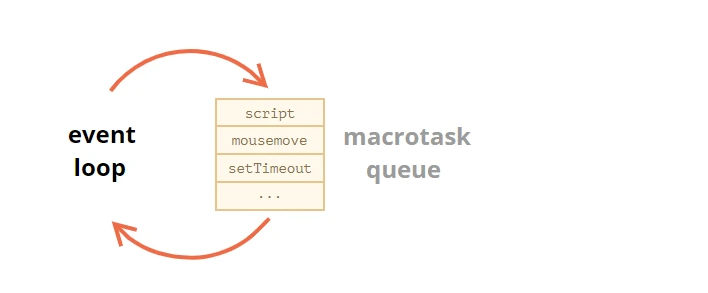
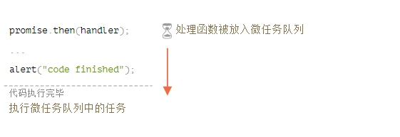
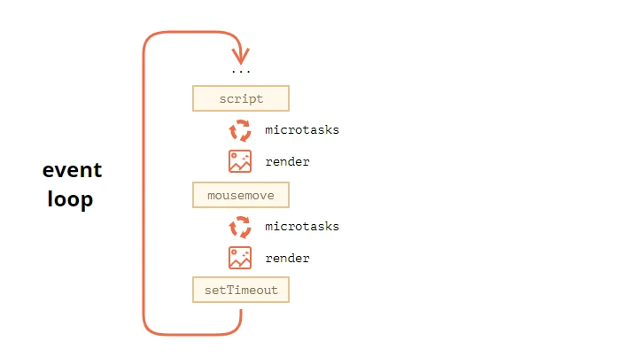

# 事件循环：微任务与宏任务

JavaScript 的执行流，无论是浏览器还是 Node.js，都是基于*事件循环*。

理解事件循环能够让我们写出更可靠的高性能代码。

让我们先介绍一下事件循环的原理，然后再来看看实际应用。

## 事件循环（Event Loop）

事件循环的概念非常简单。它就是一个无止境的循环，JavaScript 引擎等待任务（tasks）出现，然后执行任务，执行完毕后继续等待任务出现。

JavaScript 引擎对事件循环的算法为：

1. 当发现任务时：
   - 执行任务，从最先进入队列的任务开始
2. 等待其他任务出现，然后执行步骤 1。

当浏览网页时，就是以这种方式呈现。JavaScript 引擎在大部分时间都处于空闲状态，仅在被脚本文件、处理函数，事件系统激活时才运行。

比如：

- 当通过`<script src=''>`加载一个外部脚本时，这个任务将会是执行这个文件
- 当用户移动鼠标时，这个任务将是触发鼠标事件，并执行事件处理函数
- 当到了计时器设置的时间时，这个任务将是执行回调函数
- 等等。。。

任务出现 - 引擎处理任务 - 然后等待其他任务出现（空闲时 CPU 消耗几乎为 0）。

在引擎处理任务的过程中，有可能会有其他任务出现，此时其他任务将会被放进队列。

这些由任务组成的队列就叫做“宏任务队列(macrotasks queue)”（[V8](https://en.wikipedia.org/wiki/V8_(JavaScript_engine)) 术语）：



例如，当引擎正在处理一个`script`文件时，用户移动鼠标触发了`mousemove`事件，此时刚好`setTimeout`的回调函数也将执行，这些任务将会形成一个队列， 如上图所示。

来自队列的任务会按照“先进先出”的顺序来执行，当浏览器处理完毕`script`文件，然后就会执行`mousemove`事件处理函数，然后`setTimeout`回调函数，等等。

到目前为止，还算简单，对吧？

还有两条重要的详细信息：

1. 当引擎在处理任务时，页面绝对不会开始渲染。即使任务会执行很长一段时间。对 DOM 的修改仅仅在任务处理完毕后才会渲染到页面上。
2. 如果任务处理消耗很长时间，浏览器无法处理其他任务，例如用户事件，那么一段时间后浏览器将会弹框提示页面无响应，并建议关闭页面。当进行大量的复杂运算或者由于程序错误导致死循环时，弹窗就会出现。

这就是事件循环的原理。现在来看看实际应用吧。

##### 使用案例1：分离耗 CPU 的任务

假如我们有一个耗费 CPU 的任务。

例如，语法高亮（用于给示例代码上色）是非常消耗 CPU 的。为了使代码高亮，它分析、创建许多已经对代码进行高亮的元素，将他们添加到文档 - 这样的元素越多，消耗的时间越长。

当引擎正在处理语法高亮时，它无法处理其他与 DOM 相关的事情，例如处理用户事件。并且可能会带来一些我们无法接受的页面“卡住”。

我们可以通过将这些非常消耗 CPU 的任务分离成一个个的小任务来阻止这种情况。先高亮 100 行，然后设置一个计时器（延迟 0 秒）高亮下一个 100 行，等等。

为了更加简单地阐述这个过程，让我们用一个从 0 到 1 的计数函数来代替语法高亮。

如果你运行下面的代码，引擎将会卡住一段时间。对于服务端来说，更加的显而易见，如果你在浏览器中运行，然后点击页面中的其他按钮-你就会发现在计数操作执行完毕之前，其他事件都不会触发。

```javascript
let i = 0;

let start = Date.now();

function count() {

  // do a heavy job
  for (let j = 0; j < 1e9; j++) {
    i++;
  }

  alert("Done in " + (Date.now() - start) + 'ms');
}

count();
```

浏览器甚至可能会显示出一个 “the script takes too long” 的警告。

让我们使用嵌套的`setTimeout`来分离这个任务：

```javascript
let i = 0;

let start = Date.now();

function count() {

  // do a piece of the heavy job (*)
  do {
    i++;
  } while (i % 1e6 != 0);

  if (i == 1e9) {
    alert("Done in " + (Date.now() - start) + 'ms');
  } else {
    setTimeout(count); // schedule the new call (**)
  }

}

count();
```

现在即使在处理计数的过程中，浏览器的事件系统也会是可用的。

单次运行`count()`执行计数的一部分（用*号表示），如果后面还需要执行，则通过计时器再重复执行。

1. 先执行的数字：i=1...1000000
2. 然后执行的数字：i=1000001..2000000
3. 等等...

现在，如果引擎正在执行第一步时，另一个任务（例如`onclick`事件）触发，这个任务将被放入队列，然后在第一步执行完毕后、在第二步之前被执行。周期性地执行计数操作能够使 JavaScript 引擎有足够的空闲去做其他事情，比如响应用户的操作。

##### 使用案例2：进度指示

在浏览器脚本中，分离耗费 CPU 任务的另一个好处是可以显示进度信息。

通常情况下，只有在当前正在运行的代码执行完毕后，浏览器才会进行渲染。无论其是否消耗很长一段时间。当任务完成以后，浏览器才会对 DOM 操作进行渲染。

不得不说这样做有它的好处，因为函数执行过程中可能会创建多个元素、一个一个的添加到文档中并且修改它们的样式-用户不会看到任何中间的、没有完成的状态。

例如：对 i 的改变不会立即显示，而是等到函数执行完毕，所以我们只会看到最后一个值。

```javascript
<div id="progress"></div>

<script>

  function count() {
    for (let i = 0; i < 1e6; i++) {
      i++;
      progress.innerHTML = i;
    }
  }

  count();
</script>
```

...但是假如我们想在任务执行过程中展示一些额外信息，例如进度条。

如果我们把这些‘重’的任务通过`setTimeout`分离成一个一个的小任务，那么对 i 的改变会不断地被渲染出来。

例如：

```javascript
<div id="progress"></div>

<script>
  let i = 0;

  function count() {

    // do a piece of the heavy job (*)
    do {
      i++;
      progress.innerHTML = i;
    } while (i % 1e3 != 0);

    if (i < 1e7) {
      setTimeout(count);
    }

  }

  count();
</script>
```

现在，`div`元素会显示不断增加的i的值，像极了进度条。

##### 使用案例3：在事件以后做些什么

在一个事件处理函数中，我们可能会延缓执行某些操作，直到事件冒泡完成并且被所有事件阶段所处理。我们可以通过将某些操作包裹在 0 秒延迟的`setTimeout`中。

*因为原文案例设计一些额外知识([CustomeEvent 自定义事件](https://dom.spec.whatwg.org/#customevent))，为了简单起见，此处为作者提供案例*：

```javascript
    <div id='div'>
      <button id='button'>hello</button>
    </div>
    
    <script>
      div.addEventListener('click', () => {
        alert('div!')
      });
      button.addEventListener('click', () => {
        alert('button!');
        setTimeout(() => {
          alert('click事件已被处理完毕!')
        })
      })

    </script>
```

#### 宏任务和微任务

除了在上文提到过的宏任务外，还存在着*微任务(microtasks)*。

异步任务需要更准确地管理。所以，ECMA 标准定义了一个内部队列`promiseJobs`，更多地被称作是“微任务队列（microtask queue）”（ES8 术语）。

如 ESMA262 中所[定义](https://tc39.github.io/ecma262/#sec-jobs-and-job-queues):

- 微任务队列为“先进先出”：最先进入队列的任务最先执行
- 只有当目前没有运行其他任何任务时，微任务才会开始执行

简单来说，当一个`Promise`已就绪，它的`.then/catch/finally`事件处理函数将被放入队列；它们暂时不会被执行。只有当 JS 引擎处理完当前的代码，才会按照顺序执行微任务队列中的任务。

例如：

```javascript
let promise = Promise.resolve();

promise.then(() => alert("promise done!"));

alert("code finished"); // this alert shows first
```

执行上面代码，`code finished`将会先显示，然后是`promise done!`。



Promise 函数永远会按照这个顺序执行。

如果是链式的`.then/catch/finally`，那么会异步地执行每一项。也就是说，先将他们放入微任务队列，然后等待当前代码执行完毕，并且微任务队列中前面的任务执行完毕，然后执行。

如果需要按照顺序执行呢？如果确保`promise done`先显示，然后才是`code finished`呢？

只需要通过`.then`来将它们依次放入队列：

```javascript
Promise.resolve()
  .then(() => alert("promise done!"))
  .then(() => alert("code finished"));
```

微任务来自于我们的代码。通常是通过 Promise 创建，`.then/catch/finally`的处理函数成为一个微任务。同样，`await`函数也适用，它是另一种 Promise 的处理方式。

另外，通过`queueMicrotask(func)`函数可以将`func`这个函数放入微任务队列（目前IE还不支持）。

**在每一个宏任务执行完毕后，引擎会立即执行微任务队列中的所有任务，然后继续执行其他宏任务或渲染 DOM 操作。**

例如：

```javascript
setTimeout(() => alert("timeout"));

Promise.resolve()
  .then(() => alert("promise"));

alert("code");
```

上面的代码中弹框将会按照什么顺序显示呢？

1. 先显示`code`，因为它是一个普通的同步函数；
2. 然后显示`promise`，因为`.then`处于微任务队列中，所以当当前宏任务执行完毕就会执行；
3. 最后显示`timeout`，因为它是另一个宏任务。

完整的事件循环流程：（从上往下，脚本文件(宏任务) -> 微任务 -> 渲染操作 -> 重复流程...）



在任何其他的事件处理函数、渲染操作或其他宏任务执行之前，所有的微任务都会执行完毕。

如果我们希望去异步地执行一个函数（当前代码执行完毕后），但是在 DOM 操作被渲染之前，或者其他事件处理函数、宏任务执行之前，可以通过`queueMicrotask`来设置。

另一个进度指示条的例子：和上文中提到的那个类似，但是在这里用的是`queueMicrotask`，而不是`setTimeout`。在每一个宏任务执行完毕后都会进行渲染操作，就好像是同步代码：

```javascript
<div id="progress"></div>

<script>
  let i = 0;

  function count() {

    // do a piece of the heavy job (*)
    do {
      i++;
      progress.innerHTML = i;
    } while (i % 1e3 != 0);

    if (i < 1e6) {
      queueMicrotask(count);
    }

  }

  count();
</script>
```

##### 总结

更多关于事件循环算法的详细信息（和[事件循环定义](https://html.spec.whatwg.org/multipage/webappapis.html#event-loop-processing-model)来比，仍然是很简单的）：

1. 宏任务中最先进入的任务最先出列并且执行（例如脚本文件）；
2. 执行所有微任务：
   - 当微任务队列不为空时：
     - 微任务队列中最先进入的任务出列并且执行
3. 执行渲染操作（如果有对 DOM 进行修改的话）；
4. 如果宏任务队列为空的话，等待宏任务出现；
5. 执行步骤 1。

如果要设置一个新的宏任务：

- 使用 0 秒延迟`setTimeout(f)`

当把一个涉及大量运算的任务分离成一个一个的小任务时，设置新的宏任务就能够使得浏览器能够对用户的操作做出响应并展示进度。

同样可用于事件处理函数，当事件被完全处理完毕（事件冒泡完毕）后执行一个操作。

如果要设置一个新的微任务：

- 使用`queueMicrotask(f)`。
- 使用`Promise`，promise任务会处于微任务队列中。

在微任务队列处理期间，任何UI或者网络事件都不会被处理，微任务队列中的所有任务会一个一个立即执行。

所以我们可能会用`queueMicrotask`去异步执行一个函数，但是当前的环境状态（environment state）还没有被改变。

> **Web Workers**
> 如果不想阻塞事件循环，在涉及到非常大的复杂运算时，可以使用 [Web Workers](https://html.spec.whatwg.org/multipage/workers.html)。
> 通过并行线程的方式来运行代码
> Web Workers 能够与主过程交换信息，但它拥有自己的变量、事件循环
> Web Workers 不能访问 DOM，所以在进行计算时同时使用多核 CPU 是非常有用的。