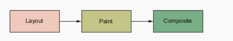

#### 浏览器的渲染流程分为三步：布局（Layout）、绘制（Paint）、混合（Composite）。

当浏览器计算出哪条样式是作用在哪个元素身上以后，就需要将样式转换成 px 并显示在屏幕上。这个过程就是渲染（rendering），整个过程可以分为三步：布局，绘制，混合。

##### 布局

渲染的第一步是布局，浏览器计算每个元素要在文档中占据的空间。因为有默认的文档流，元素的大小和位置会影响到页面中其他元素的大小和位置。布局就是将他们计算出来。

任何时候改变一个元素的宽高或者调整它的定位偏移值（Left / top 等），浏览器就会重新计算这个元素的布局。同样的，如果插入一个元素到文档流中，或者通过 JS 从文档流中移除一个元素，浏览器也会重新计算该元素的布局。当一个元素的布局发生改变，浏览器必须重新计算其他被该元素所影响的元素的布局，这个过程称为「回流」。

##### 绘制

布局后，就是绘制了。绘制就是将布局还原成 px：文本、图片、边框和阴影等。这个过程可能不会显示在屏幕上，而是绘制到内存中。页面中的某些部分将会绘制为「层」。

假设改变某个元素的背景颜色，浏览器就会重新绘制这个元素。但是，由于背景颜色不会对页面中其他元素的大小或者位置造成影响，浏览器不需要重新计算布局；相对来对，修改元素的大小比修改背景颜色更加耗费计算资源。

正常情况下，页面中的元素可以被提取到一个自己的「层」。浏览器会分别绘制页面中的每个「层」，浏览器会将这些「层」发送给计算机的 GPU（Graphics processing unit）渲染，而不是和页面中的「主层」一样通过 CPU 来处理。通过 GPU 渲染能够加快处理速度，因为 GPU 有做最优化处理。

通常这被称之为*硬件加速（Hardwar acceleration）*，因为它依赖于计算机的硬件去为它提供渲染加速。更多的「层」意味着更多的资源消耗，但是他能够加快页面的渲染速度。

##### 混合

混合就是浏览器绘制出所有的「层」，形成最后的图像，并且展示到页面上。各个「层」将会以特定的顺序排列，为的是在有元素发生覆盖的地方，各层级之间能够正确的显示。

当更改 opacity 或者是 transform 属性时，渲染时间比更改其他属性要快很多。因为浏览器会将这些元素提升到一个特定的「层」并且使用 GPU 加速渲染。因为元素位于它自己所处的「层」，所以在 opacity 或者是 transform 变换的过程中，它不会对「主层」造成影响或重复绘制。

在对页面进行小改动时，GPU 的最优化通常不会有影响。但是如果对动画效果做出改变，屏幕就需要在一秒内更新几十次；在这种情况下，渲染速度就成问题了。大部分的屏幕一秒钟刷新 60 次（60 HZ），所以理想情况下，如果要使动画在屏幕上尽可能流畅的显示，对动画做出的改变最少也会被计算这么多次。浏览器每次计算的任务越多，渲染的速度就越慢。

> 使用 will-change 属性控制「层」
>
> 浏览器已就优化渲染流程努力了很久，为的是将元素尽可能地分离成单独的「层」 。如果动画效果来自 opacity或 transform 属性，在现代浏览器中，为了使动画能够流畅的显示，通常会根据各种条件，例如系统资源，来做出一个比较好的决定。但是偶尔会遇到闪烁等问题。
>
> 如果你碰到过这种情况，你可以使用 will-change 属性来控制渲染中的「层」。这个属性会提前告诉浏览器准备接受需要改变的特定的属性。浏览器就会把这个元素提升到单独的「层」来渲染。例如：`will-change: transform` 代表你将要改变这个元素的 transform 属性。
>
> 但是，尽量不要使用这个属性，除非你遇到过以上问题，因为它会使用更多的系统资源。最好是在发现它使动画的渲染变得更加流畅的情况下才使用。更进一步的了解此属性，查看这篇[文章](https://dev.opera.com/articles/css-will-change-property/)
>
> 值得注意的是自从这篇文章发布以后有些事情在悄然发生变化，以前只有 3D 转换才会提升为自己的「层」，但是现在现代浏览器已经支持通过 GPU 加速为 2D 提供自己的「层」了。

当我们在使用动画的时候，最好是使用 transform 或者 opacity。然后才考虑使用可能会引起「重绘」的属性，不要不得已不要使用会引起重新布局的属性来设置动画，如果使用了，就要当心是否造成了性能问题。如果你想知道哪些属性会影响布局、绘制和混合，[看这里](https://csstriggers.com/)。

> 参考：
> 《CSS in Depth》 by Keith J. Grant