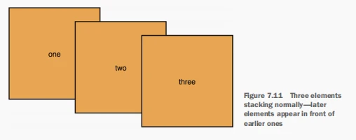
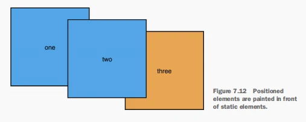
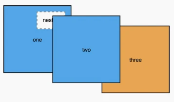

你是否在使用定位时，会遇到一个定位元素即使设置更高的层级，也无法将另一个定位元素覆盖的情况？通过理解层叠上下文，你就能更好的构建你的应用。

### 理解渲染流程和层叠顺序

当浏览器将 HTML 解析成 DOM 结构时，它同样会创建另一个树结构 - 渲染树。经过它渲染之后就成了用户所看到的视图，它同样决定了浏览器绘制 HTML 元素的顺序。这个顺序很重要，因为越是后面渲染的元素，它的显示顺序就越靠前，也就可能会覆盖前面的元素。

在没有定位的情况下， 这个渲染顺序是由 HTML 元素的顺序决定的，例如有以下 HTML 结构：

```html
<div>one</div>
<div>two</div>
<div>three</div>
```

它们的层叠顺序如下图，在这里作者使用了一些负的外边距来强制元素覆盖，但是没有使用定位。越是后面渲染的元素，它显示的就越靠前。



当你使用定位时，这种表现就会改变。浏览器首先绘制没有使用定位的元素，然后绘制使用定位的元素。默认情况下，使用定位的元素会显示在没有使用定位的元素前面，在下图中，将前面的两个元素设置了定位 `position: relative`，它们的显示顺序就会变得靠前，覆盖住第三个没有定位的元素（position 属性的默认值是 static，即没有定位），即使位于 HTML 结构中的顺序没有改变。

注意这些定位元素中，第二个元素仍然显示在第一个元素前面。首先定位元素会显示在正常元素前面，然后根据 HTML 结构中的顺序来决定定位元素的显示，也就是后面的靠前显示。



### 什么是层叠上下文

由浏览器绘制出的一个或多个元素组成的 DOM 树形成一个层叠上下文。当你设置 z-index 属性到一个定位元素上（position 为 relative，absolute，fixed，sticky），这个元素就会创建一个新的层叠上下文，并且会成为这个层叠上下文的根元素。这个根元素的所有子元素都是这个层叠上下文的一部分。

层叠上下文的子元素都是在它的内部绘制，所以位于层叠上下文外部的元素无法设置自身的位置处于层叠上下文内部的子元素之间。也就是说外部元素 C 无法处于层叠上下文的子元素 A 和 B 的中间。同样，当设置一个元素 C 覆盖住另一个元素 D 时，D 元素内部的子元素是无法位于元素 C 上面的。

用例子来阐述下：

```html
<div class="box one positioned">
 one
 <div class="absolute">nested</div>
</div>
<div class="box two positioned">two</div>
<div class="box three">three</div>
```

上面 HTML 结构中包含三个类名为 box 的元素，其中的两个会使用定位，并且设置它们的 z-index 值为 1。第一个 .box 元素中的 .absolute 子元素会使用定位并且设置 z-index 的值为 100；即使 .abosolute 的的 z-index 值很高，但是它仍然会被第二个 .box 元素覆盖，因为它的父元素 - 第一个 .box 元素的层叠上下文位于第二个 .box 元素的层叠上下文的前面。



以下为 CSS 代码

```css
body {
 margin: 40px;
}
.box {
 display: inline-block;
 width: 200px;
 line-height: 200px;
 text-align: center;
 border: 2px solid black;
 background-color: #ea5;
 margin-left: -60px; // 使后面的元素覆盖在其他元素上
 vertical-align: top;
}
.one { margin-left: 0; }
.two { margin-top: 30px; }
.three { margin-top: 60px; }
.positioned {   // 每一个定位元素都会建立一个 z-index 为 1 的层叠上下文
 position: relative; 
 background-color: #5ae; 
 z-index: 1; 
} 
.absolute {
 position: absolute;
 top: 1em;
 right: 1em;
 height: 2em;
 background-color: #fff;
 border: 2px dashed #888;
 z-index: 100;  // z-index 属性仅会控制自身处于当前层叠上下文中的位置
 line-height: initial;
 padding: 1em;
}
```

因为被第二个 .box 元素覆盖的第一个 .box 元素属于层叠上下文的根元素，所以它的子元素，使用绝对定位的 .positioned 元素不会显示在第二个 .box 元素的前面，即使这个子元素拥有很高的 z-index 值。

> 通过给定位元素添加 z-index 属性是最常见的创建层叠上下文的方式，但是还有其他的一些属性同样可以创建层叠上下文。例如：
>
> 设置透明度小于 1 、transform、filter、属性等都会创建层叠上下文，这些属性会影响到元素和它的子元素，所以它们属性同一个层叠上下文。文档根元素（html）元素同样会为整个页面创建一个顶级的层叠上下文。
>
> 当然还有其他属性也会创建层叠上下文，但我们用的还是比较少，感兴趣的可以参考 [MDN](https://developer.mozilla.org/en-US/docs/Web/CSS/CSS_Positioning/Understanding_z_index/The_stacking_context)

一个层叠上下文中的元素按照以下顺序显示，从后面到前面：

- 层叠上下文的根元素
- 定位元素具有负的 z-index 值的（它子元素也是一样的）
- 未定位元素（`position: static` 是默认值，相当于没有定位）
- 定位元素具有 `z-index: auto` （它的子元素也是一样的）
- 定位元素具有一个正的 z-index 值（它的子元素也是一样的）

> 使用变量去跟踪 z-index 属性
>
> 滥用 z-index 属性会使样式文件变得难以维护，没有一个清晰的层级顺序的话，组件之间容易陷入一场 “z-index” 之争。如果没有规范要求，开发者可能会添加一个模态框组件，因为担心模态框组件被其他组件覆盖，所以给它加了一个相当高的层级，例如“999999”。
>
> 当相同的情况在同一个页面多发生几次之后，就不知道该给新的组件设置多大的层级了。
>
> 如果你有使用 CSS 预处理器，例如 SASS 或 LESS，或者你需要做兼容的浏览器都支持 [CSS 变量](https://developer.mozilla.org/en-US/docs/Web/CSS/Using_CSS_custom_properties)，那么就可以优雅的解决这个问题。
>
> 将所有 z-index 属性值存入变量中，集中放到一个地方。这样你只需要轻松一瞥就能看出谁会显示在谁的前面：
> `--z-loading-indicator: 100;`
> `--z-nav-menu: 200;`
> `--z-dropdown-menu: 300;`
> `--z-modal-backdrop: 400;`
> `--z-modal-body: 410;`
>
> 使用 10 或 100 的升序排列，这样你就可以轻松的插入一些你想要显示在其他元素前面的 z-index。

如果你发现你设置了 z-index 属性的元素没有按照你希望的方式显示，则应该看看 DOM 结构，找到当前层叠上下文的根元素，然后设置更高的 z-index 属性来提升或降低整个层叠上下文的层级。在开发中要注意，可能存在一个层叠上下文中嵌套着多个层叠上下文的情况。

当页面变得复杂，通常难以看出当前的组件属于哪一个层叠上下文。所以当你在创建层得上下文的时候就要小心了。尽量不要创建层叠上下文，除非有特殊的原因。尤其是在构建大型应用程序的时候。

尽可能的将定位元素，例如模态框等，放在 DOM 的最高层级下，例如在 `</body>` 标签的前面，这样你就不需要担心外部可能存在的层叠上下文了。

有些开发者将页面中的很多的元素都设置定位。好的方式不应该是这样，你使用的定位元素越多，页面就会变得越复杂， 并且变得难以调试。如果你正在大量使用定位元素，那么现在是时候好好调整下了。你构建页面布局的方式是非常重要的，当你能够使用其他方法完成布局时，最好使用这些方法，而不是定位。

如果你能够利用文档流（Document flow）的特点去为你实现布局，而不是直接使用定位，浏览器会帮你考虑一些可能存在的边缘情况。记住，使用定位使元素脱离标准文档流。通常情况下，只有当你需要将一个元素覆盖在另一个元素的前面时，才考虑使用定位。

> 参考：
> 《CSS in Depth》Keith J. Grant